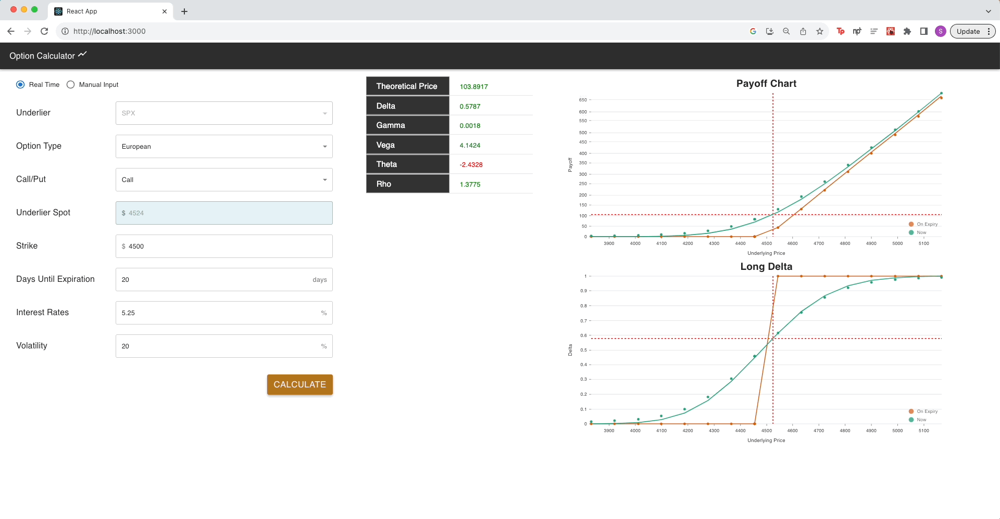
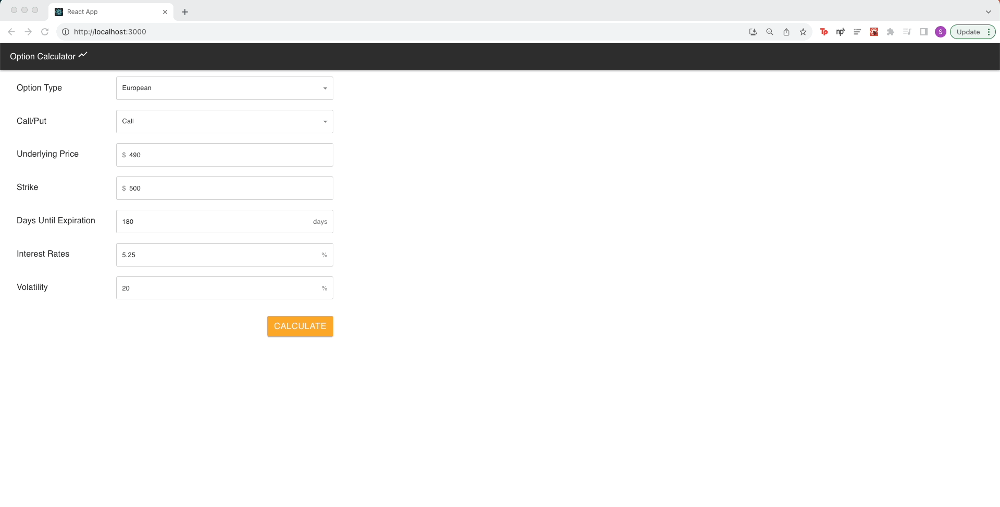

# OptionCalculator

## What is it about?

Pet project to write option calculator in c++, and use pybind to export C++ API to python. Front-End written using ReactJS and MUI.

Real Time Mode (Updated: 20th August 2023)

Manual Mode:

## Result

It is very interesting to see C++ + Pybind is much faster than python. Please see the images below for time difference:

- Call option pricing time:
- 
- Call option implied volatility calculation time:
- 

# TODO

- Python code to webscrape live delayed quotes for option (i.e. SPX index)
- Live Stream delayed spot price for an underlyer
- dropdown option for greek chart
- concurrency front-end request call to the backend server
- Mark segments of ATM, ITM, OTM
- Color the underlying price dot on the chart
